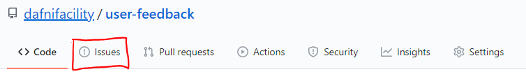
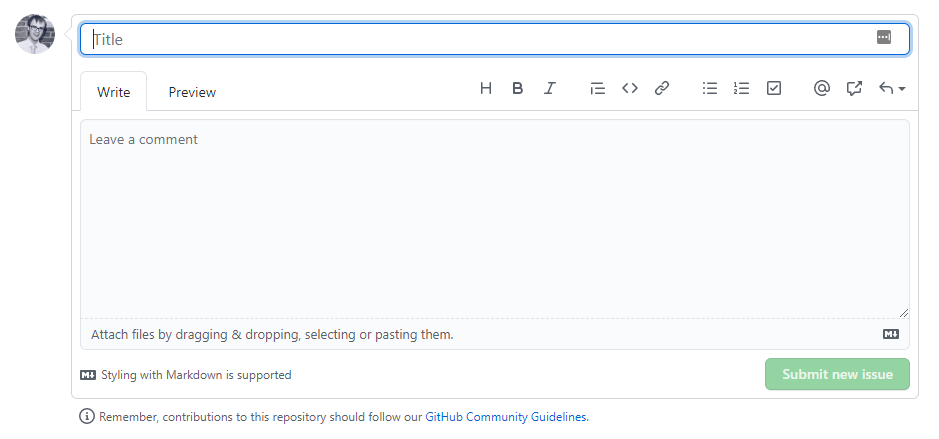

# DAFNI User Feedback
A place for gathering user feedback and providing support.

Issues can be used to keep track of bugs, enhancements, or other requests.

Any GitHub user can create an issue in a public repository where issues have not been disabled.

You can open a new issue based on code from an existing pull request. For more information, see "Opening an issue from code."

You can open a new issue directly from a comment in an issue or a pull request review. For more information, see "Opening an issue from a comment."

If you're using a project board to track and prioritize your work, you can convert project board notes to issues. For more information, see "About project boards" and "Adding notes to a project board."

1) Click  Issues.

2) Click New issue.

3) If there are multiple issue types, click Get started next to the type of issue you'd like to open.

4) Select the type of issue you want to create

5) Optionally, click Open a blank issue. if the type of issue you'd like to open isn't included in the available options.

6) Type a title and description for your issue.

7) When you're finished, click Submit new issue.
